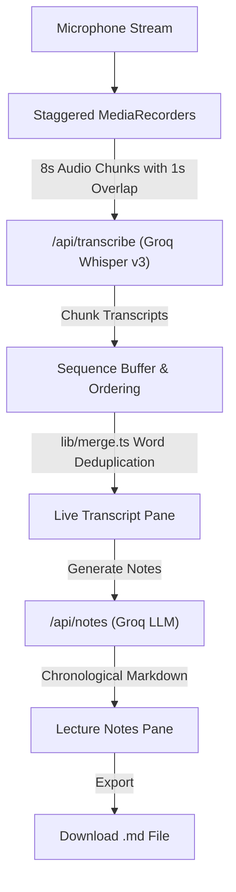

# 🎙️ LectureLogger

A real-time speech-to-notes web application built with **Next.js 15**, **React 19**, and **Groq Cloud**. 

Record lectures, meetings, or discussions directly from your microphone, transcribe them live with near-zero latency using Groq's `whisper-large-v3`, and instantly transform the raw transcript into structured, chronological Markdown lecture notes with Groq LLMs.

---

## ✨ Features

- **🔴 Staggered Live Recording**: Uses dual interleaved `MediaRecorder` instances with overlapping time windows (8s window, 7s stride = 1s overlap) so speech across chunk boundaries is never cut off.
- **⚡ Ultra-Fast Transcription**: Chunks are streamed to Groq's `whisper-large-v3` API endpoint with sub-second turnaround.
- **🧩 Smart Client-Side Deduplication & Reordering**: Transcriptions arriving out of order are sequenced and merged using a word-level overlap algorithm (`lib/merge.ts`).
- **📝 Chronological Note Generation**: Converts messy transcripts into polished Markdown notes that preserve the lecture's natural chronology, formatted with headers, definitions, and key takeaways.
- **✏️ Dual Editable Panes**: Edit the live transcript or generated notes directly in real time.
- **💾 One-Click Export**: Download structured lecture notes directly as a timestamped `.md` file client-side.
- **🔒 Privacy First & Stateless**: Audio and text live in browser memory; API keys never reach the client.

---

## 🛠️ Tech Stack

- **Framework**: [Next.js 15](https://nextjs.org/) (App Router, Node.js runtime)
- **UI & State**: [React 19](https://react.dev/), [Tailwind CSS v4](https://tailwindcss.com/)
- **AI & Speech**:
  - Transcription: Groq `whisper-large-v3`
  - Note Generation: `openai/gpt-oss-120b` (or custom configured via env)
- **Language**: TypeScript
- **Testing**: Node.js built-in test runner (`node --test`)

---

## 🚀 Getting Started

### 1. Prerequisites

- Node.js 18.18+ (Node 20+ recommended)
- A Groq API key (Get one for free at [console.groq.com/keys](https://console.groq.com/keys))

### 2. Installation

Clone the repository and install dependencies:

```bash
npm install
```

### 3. Environment Setup

Copy the example environment file and add your Groq API key:

```bash
cp .env.local.example .env.local
```

Edit `.env.local`:

```env
GROQ_API_KEY=gsk_your_groq_api_key_here

# Optional: override note-generation model (default: openai/gpt-oss-120b)
# GROQ_NOTES_MODEL=openai/gpt-oss-120b
```

### 4. Run Development Server

```bash
npm run dev
```

Open [http://localhost:3000](http://localhost:3000) in your browser.

> **Note**: Modern browsers require HTTPS or `localhost` to grant microphone permissions.

---

## 🧠 How It Works



1. **Audio Capture**: Staggered `MediaRecorder` instances record overlapping 8-second chunks every 7 seconds.
2. **Chunk Transcription**: Each chunk is uploaded to `/api/transcribe` and sent to Groq `whisper-large-v3` with `temperature: 0` for consistent transcription.
3. **Sequence Buffering & Merge**: Responses that finish out of order are held in a sequence map until ready. `mergeOverlap()` detects and trims repeated words across consecutive chunk boundaries.
4. **Note Structuring**: Clicking **Generate Notes** sends the accumulated transcript to `/api/notes`, prompting Groq to generate hierarchical, clean Markdown notes.
5. **Download**: Creates a client-side Blob URL to export the notes as `lecturelogger-YYYY-MM-DD.md`.

---

## 📁 Project Structure

```
.
├── app/
│   ├── api/
│   │   ├── notes/
│   │   │   └── route.ts          # Note generation endpoint (Groq LLM)
│   │   └── transcribe/
│   │       └── route.ts          # Audio transcription endpoint (Groq Whisper)
│   ├── globals.css               # Tailwind CSS styles
│   ├── layout.tsx                # App root layout & metadata
│   ├── page.tsx                  # Home page entry
│   └── Recorder.tsx              # Main audio recording & UI component
├── lib/
│   ├── merge.ts                  # Word-overlap deduplication & merge algorithm
│   └── merge.test.ts             # Unit tests for chunk deduplication
├── .env.local.example            # Sample environment variables
├── package.json
└── tsconfig.json
```

---

## ⚙️ Configuration & Tuning

- **Chunking Timing**: You can tune chunk length and stride inside [`app/Recorder.tsx`](file:///Users/aarushgupta/Desktop/Notes/app/Recorder.tsx):
  ```ts
  const CHUNK_MS = 8000;  // Length of each audio chunk
  const STRIDE_MS = 7000; // Interval between consecutive chunk starts (1s overlap)
  ```
- **Custom LLM Model**: Set `GROQ_NOTES_MODEL` in `.env.local` to switch between models available on your Groq catalog (e.g., `llama-3.3-70b-versatile`, `mixtral-8x7b-32768`, etc.).

---

## 🧪 Testing

Run unit tests for the overlap merging logic:

```bash
npm test
```

---

## 📄 License

MIT
